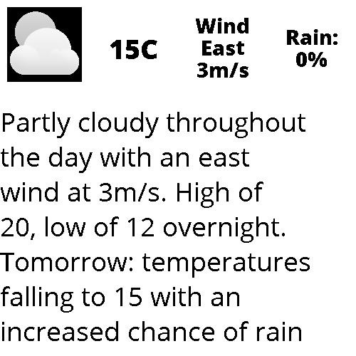
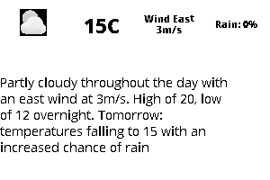

# epdlib 
EpdLib is a library for creating dynamically scaled screen layouts for frame-buffered devices such as e-paper/e-ink displays. Complex layouts are defined as image or text blocks. Using epdlib blocks makes it trivial to develop for different disiplay resolutions as layouts are aware of thier resolution and scale the blocks dynamically to match the available area.

## Dependencies
Python Modules:
* Pillow
    - System dependencies for Pillow:
        * libopenjp2-7
        * libtiff5
* RPi.GPIO
* spidev
    - ensure SPI is enabled on the pi
* waveshare-epd 
    - this is for interacting with waveshare epaper displays and is not strictly needed to use the Block and Layout objects.
    - see [notes](#Notes) below for installation instructions


**Modules:**
* Block - image and text blocks that can be assembed into a final layout
* Layout - generate dynamic layouts from Blocks
* Screen - simple interface for waking and writing to WaveShare EPD devices

- [epdlib](#epdlib)
  * [Block Module](#block-module)
    + [Properties](#properties)
    + [Methods](#methods)
  * [Block.TextBlock](#blocktextblock)
    + [Properties](#properties-1)
    + [Functions](#functions)
    + [Methods](#methods-1)
  * [Block.ImageBlock](#blockimageblock)
    + [Properties](#properties-2)
  * [Layout Module](#layout-module)
  * [Scaling Example](#scaling-example)
    + [Properties](#properties-3)
    + [Methods](#methods-2)
    + [Functions](#functions-1)
  * [Screen Module](#screen-module)
    + [Properties](#properties-4)
    + [Methods](#methods-3)
    + [Example](#example)
  * [Screen.Update](#screenupdate)
    + [Properties](#properties-5)
    + [Methods](#methods-4)
    + [Example](#example-1)
  * [Screen.ScreenShot](#screenscreenshot)
    + [Properties](#properties-6)
    + [Methods](#methods-5)
  * [Quick-Start Recipe](#quick-start-recipe)
    + [Creating a Layout Image](#creating-a-layout-image)

<small><i><a href='http://ecotrust-canada.github.io/markdown-toc/'>Table of contents generated with markdown-toc</a></i></small>


## Block Module
`Block` objects are containers for text and images. `Block` objects are aware of their dimensions and can be made aware of their position within a larger layout. `Block` objects can also handle wrapping text and resizing images to fit within their borders.
*Class* `Block(area, hcenter=False, vcenter=False, rand=False, inverse=False, abs_coordinates=(0, 0), padding=0)`

### Properties
* `area` (2-tuple of int): area of block in pixles - required
* `hcenter` (bool): True - horizontally center image within block, center justify text
    - Default: False
* `vcenter` (bool): True - vertically center text within block
    - Default: False
* `rand` (bool): True - randomly place text within area of block (mutually exclusive of hcenter and vcenter)
    - Default: False
* `inverse` (bool): True - invert colors (black becomes white, white becomes black)
    - Default: False
* `abs_coordinates` (tuple): X, Y coordinates of upper left corner of image block within a larger layout
    - Default: (0, 0)
* `padding` (int): padding to add around text/image and edge of block
    - Default: 0

### Methods
`update(update)`
Place holder method for child classes.
 

## Block.TextBlock
Child class of `Block` that contains formatted text. `TextBlock` objects can do basic formatting of strings. Text is always rendered as a 1 bit image (black on white or white on black). Text can be horizontally justified and centered and vertically centered within the area of the block. 

All properties of the parent class are inherited.

*Class* `Block.TextBlock(font, area, text='NONE', font_size=0, max_lines=1, maxchar=None, chardist=None)`

`TextBlock` objects will attempt to calculate the appropriate number of characters to render on each line given an area, font face and character distribution. Each font face renders characters at a different width and each TTF character uses a different X width (excluding fixed-width fonts). Each language favors certain characters over others. 

### Properties
* `font` (str): path to TTF font face - relative paths are acceptable
* `area` (2-tuple of int): area of block in pixles - required
* `text` (str): string to format 
    - Default: 'NONE'
* `font_size` (int): font size in points
    - Default: 0
* `max_lines` (int): maximum number of lines to use when wrapping text
    - Default: 1
* `maxchar` (int): maximum number of characters to fit on a line
    - if set to `None`, the text block will calculate this value based on the font face and specified `chardist`
    - Default: None
* `chardist` (dict): statistical character distribution for a supported language to use for a specified font
    - dictionary of letter and float representing fractional distribution (see `print_chardist`)
* `image` (PIL.Image): resultant image generated of formatted text

### Functions
* `print_chardist(chardist=None)` - print supported character distrubtions
    - chardist (str)
        - `chardist='USA_CHARDIST'` print the character distribution for USA English

### Methods
* `update(update=None)` - Update the text string with a new string and sets `image` property
    - update (str)

## Block.ImageBlock
Child class of `Block` that contains formated images. `ImageBlock` objects do basic formatting of color, centering and scaling. All `ImageBlock` images are 8 bit grayscale `Pillow.Image(mode='L')`. Images that are too large for the area are rescaled using the `Pillow.Image.thumbnail()` strageies to limit distortion. Images that are smaller than the set area will **not** be resized.

All properties of the parent class are inherited.

*Class* `Block.ImageBlock(area, image=None)`

### Properties
* `image` (:obj:PIL.Image or :obj:str) - `Pillow` image or path provided as a `str` to an image file; relative paths are acceptable

## Layout Module
`Layout` objects support scaling images and dynamically scaling [TTF](https://en.wikipedia.org/wiki/TrueType) font-size for different screen sizes. 

Font sizes are set based on each individual font and scaled to fit within text blocks using the maximum number of lines specified in the layout. Text is line-broken using the python [textwrap logic](https://docs.python.org/3.7/library/textwrap.html).

*Class* `Layout(resolution, layout=None)`

## Scaling Example
epdlib `Layout` objects can be scaled to any resolution while maintaining internally consistent ratios.

**500x500 Layout**



**300x200 Layout**



### Properties
* `resolution` (2-tuple of int): resolution of the entire screen in pixles
* `layout` (dict): dictionary containing layout paramaters for each block
    - see example below in Quick-Start Recipe
* `image` (Pil.Image): concatination of all blocks into single image

### Methods
    - see example below in Quick-Start Recipe
* `concat()` : join all blocks into a single image
    - sets '

### Functions
* `update_contents(updates=None)` - update the contents of each block
    - updates (dict)
        - dictionary in the format `{'text_section': 'text to use', 'image_section': '/path/to/img', 'pil_img_section': PIL.Image}`


## Screen Module
`Screen` objects provide a method for waking and writing to a WaveShare E-Paper Display (EPD). `Screen` objects are aware of their resolution and when they were last updated (stored in monotonic time). 

*Class* `Screen(resolution=None, epd=None)`

### Properties
* `resolution` (2 tuple of int): resolution in pixels 
    - this is overriden by the epd object resolution when it is set
* `epd` (WaveShare EPD module)
    - the waveshare library that will be used for the actual writing of data to the screen
* `update` (obj:Screen.Update): monotonicly aware object that tracks time since last update


### Methods
* `clearScreen()` - Set a blank image screen
* `clearEPD()` - send the clear signal to the EPD to wipe all contents and set to "white"
* `writeEPD(image, sleep=True)` - and write `image` to the EPD. 
    - resets update timer
    - Defaults to putting the display to low power mode
* `intiEPD()` - initializes the EPD for writing

### Example
```
import Screen
import waveshare_epd
myScreen = Screen()
myScreen.epd = waveshare_epd.5in83
myScreen.initEPD()
myScreen.writeEPD('./my_image.png')
```


## Screen.Update
Create a monotonically aware object that records the passage of time.

*Class* `Screen.Update()`

### Properties
* `age` (float): age in seconds since creation
* `now` (float): time in [CLOCK_MONOTONIC](https://linux.die.net/man/3/clock_gettime) time
* `last_updated` (float): time in seconds since last updated
* `update` (bool): True - trigger resets last_updated time

### Methods
* `update(update=True)` - reset last_updated timer to zero

### Example
```
import Screen
u = Update()
u.now
>>> 357147.118559987
u.age
>>> 37.449310125026386
u.last_updated
>>> 62.2587232599617
u.update = True
u.last_updated
>>> 0.00021347898291423917
```

## Screen.ScreenShot
Capture a rolling set of screenshots. When the total number of screenshots exceeds `n` the oldest is deleted. Images are stored as .png.

This is useful for debugging over time.

*Class* `Screen.ScreenShot(path='./', n=2, prefix=None)`

### Properties
* `total` (int): total number of screenshots to keep
* `prefix` (str): prefix to add to filenames
* `time` (str): time in format: %y-%m-%d_%H%M.%S - 2020-02-29_1456.39
* `img_array` (list): list of files stored in `path`

### Methods
* `delete(img)`: delete `img` file
* `save(img)`: save `img` to `path`
    - img: PIL.Image
```
import Screen
scrnShot = Screen.ScreenShot(path='/temp/', n=20)
spam = PIL.Image.new(mode='L', size=(100, 100), color=0)
scrnShot.save(spam)
```

## Quick-Start Recipe
The following recipe will produce the screen layout shown above for a 640x400 pixel display. This image can be passed directly to a WaveShare e-Paper display for writing.

### Creating a Layout Image
```
import epdlib

# create the layout object
myLayout = epdlib.Layout(resolution=(640, 400))

# define a layout
l = { # basic two row layout
    'weather_img': {                
            'image': True,               # image block
            'padding': 10,               # pixels to padd around edge
            'width': 1/4,                # 1/4 of the entire width
            'height': 1/4,               # 1/4 of the entire height
            'abs_coordinates': (0, 0),   # this block is the key block that all other blocks will be defined in terms of
            'hcenter': True,             # horizontally center image
            'vcenter': True,             # vertically center image
            'relative': False,           # this block is not relative to any other. It has an ABSOLUTE position (0, 0)
        },
    'temperature': { 
                'image': None,           # set to None if this is a text block
                'max_lines': 1,          # maximum lines of text to use when wrapping text
                'padding': 10,           # padding around all edges (in pixles)
                'width': 1/4,            # proportion of the entire width
                'height': 1/4,           # proprtion of the entire height
                'abs_coordinates': (None, 0), # absolute coordinates within the final image (use None for those
                                              # coordinates that are relative to other blocks and will be calculated
                'hcenter': True,         # horizontal-center the text and the resulting image
                'vcenter': True,         # vertically-center the text within the block
                'relative': ['weather_img', 'temperature'], # blocks to which THIS block's coordinates are relative to
                                                            # -- in this case X: `weather_img` and Y: `temperature`
                                                            # the width of the block `weather` will be used to
                                                            # to calculate the X value of this block and the Y value
                                                            # specified within the `temperature` block will be used 
                'font': './fonts/Open_Sans/OpenSans-ExtraBold.ttf', # TTF Font face to use; relative paths are OK
                'font_size': None         # set this to None to automatically scale the font to the size of the block
    },
    'wind': { 
                'image': None,
                'max_lines': 3,
                'padding': 0,
                'width': 1/4,
                'height': 1/4,
                'abs_coordinates': (None, 0),
                'hcenter': True,
                'vcenter': True,
                'relative': ['temperature', 'wind'],
                'font': './fonts/Open_Sans/OpenSans-ExtraBold.ttf',
                'font_size': None
    },
    'rain': { 
                'image': None,
                'max_lines': 3,
                'padding': 0,
                'width': 1/4,
                'height': 1/4,
                'abs_coordinates': (None, 0),
                'hcenter': True,
                'vcenter': True,
                'relative': ['wind', 'rain'],
                'font': './fonts/Open_Sans/OpenSans-ExtraBold.ttf',
                'font_size': None
    },    
    'forecast': {
                'image': None,
                'max_lines': 7,
                'padding': 10,
                'width': 1,
                'height': 3/4,
                'abs_coordinates': (0, None),
                'hcenter': False,
                'vcenter': True,
                'relative': ['forecast', 'temperature'],
                'font': './fonts/Open_Sans/OpenSans-Regular.ttf',
                'font_size': None,
                'scale_y': .85
    }

}

# apply the layout instructions to the layout object
myLayout.layout = l

# create a dictionary with the values that will be pushed to each block
update = {
    'weather_img': './docs/Avatar_cloud.png',      # weather_img block will recieve a .png
    'temperature': '15C',                     # temperature block will receive `15C`
    'wind': 'Wind East 3m/s',                 # wind block will recieve this text
    'rain': 'Rain: 0%',                       # rain block
    'forecast': 'Partly cloudy throughout the day with an east wind at 3m/s. High of 20, low of 12 overnight. Tomorrow: temperatures falling to 15 with an increased chance of rain'
}

# update the layout with the data in the dictionary
myLayout.update_contents = update

# join all the sub images into one complete image
myImg = myLayout.concat()

# write the image out to a file
myImg.save('./my_forecast.png')

```
<a name="Notes"></a>
## Notes
The Waveshare-epd library is not provided in an easily usable format. As of 1 Oct 2020, it cannot be directly installed with `pip` or `pipenv`. The package maintainers have used a literal '&' character in the subdirectory for the library making it extra difficult to use. Try the following to install it:

```
pipenv install -e "git+https://github.com/waveshare/e-Paper.git#egg=waveshare_epd&subdirectory=RaspberryPi\&JetsonNano/python"
```

This will likely result in a heap of errors. The library is not installed, but it does fetch the source.
```
    ERROR: Error [Errno 2] No such file or directory: '/home/pi/.local/share/virtualenvs/epdlib-AIMLabQa/src/waveshare-epd/RaspberryPi': '/home/pi/.local/share/virtualenvs/epdlib-AIMLabQa/src/waveshare-epd/RaspberryPi' while executing command python setup.py egg_info
ERROR: Could not install packages due to an EnvironmentError: [Errno 2] No such file or directory: '/home/pi/.local/share/virtualenvs/epdlib-AIMLabQa/src/waveshare-epd/RaspberryPi': '/home/pi/.local/share/virtualenvs/epdlib-AIMLabQa/src/waveshare-epd/RaspberryPi
```

Finally install the library with:
```
MYVENV=$(pipenv --venv) pipenv install -e $MYVENV/src/waveshare-epd/RaspberryPi\&JetsonNano/python
```

getting ready for pypi:
https://medium.com/@joel.barmettler/how-to-upload-your-python-package-to-pypi-65edc5fe9c56


```python
!jupyter-nbconvert --to markdown --stdout > README.md
```


```python

```
