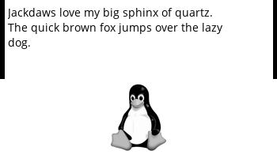
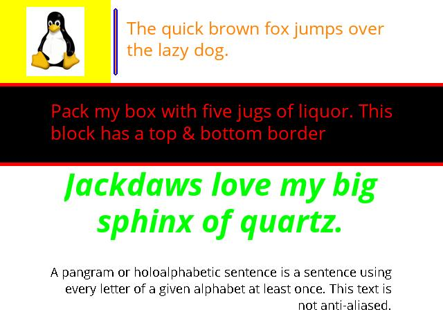
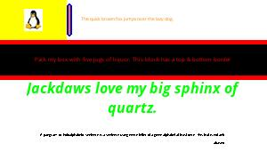

# Layout Module

`Layout` objects are recipes for building an image that will fit on any resolution screen. Build a layout once and it will work on any resolution screen and scale the content appropriately to fit. The same layout can easily be displayed on a variety of displays with different height/width ratios and resolutions with no additional coding.


Layouts can be built from any type of [`Block`](./Block.md) object. Each block can have its own mode ('1', 'L', 'RGB') as needed.

The example below shows the same content laid out in a 500x500 display and a 300x200 display. The images and text are scaled appropriately to fit within the different resolution and height/width ratios.

**500x500 Layout**


**300x200 Layout**


## *Class* `Layout(resolution, layout=None, force_onebit=False, mode='1')`

A configured `Layout` object calculates the size and absolute position of the various elements and joins them together into a single image that can easily be written to an EPD screen.

### Properties

* `resolution` (2-tuple of int): resolution of the entire screen in pixels
* `blocks` (dict): dictionary containing of configured `Block` objects
* `layout` (dict): [layout dictionary](#layout-dictionary) containing layout parameters for each block
    - sets `blocks` property
* `image` (Pil.Image): concatenation of all blocks into single image
* `force_onebit` (bool): force all blocks within a layout to `mode='1'`
* `mode` (str): PIL image mode to use for generating the image
    - supports `'1'` 1 Bit, `'L'` 8 bit Gray, `'RGB'`: 8 Color RGB 

### **Methods**

*****

### `concat()`

Join all blocks into a single image and sets `image` property

#### Args

* None

#### Returns

* `PIL.Image`

### `update_block_props(block, props={}, force_recalc=False)`

Update the properties of a block. TextBlocks will always be recalculated to ensure the current font settings are still valid. NB! The contents must be updated using `update_contents` for the updated properties to be reflected in the `image` property.

#### Args

*  `block` (str): name of existing block
* `props` (dict): dictionary of properties to update in the block
* `force_recalc` (bool): force the recalculation fo all blocks. Use this if the positioning, size or resolution changes.

### Returns

* None

#### `update_contents(updates=None)`

Update the contents of each block

#### Args

* `updates` (dict): dictionary in the format `{'text_section_A': 'text to use', 'image_section_B': '/path/to/img', 'pil_img_section': PIL.Image}`

### **Layout Dictionary**

*****

A layout dictionary consists of at least one section that contains all of the required `Block` properties specific for that block type. Each layout is processed sequentially from the top to the bottom of the dictionary. The first section must contain an absolute position; all subsequent positions can and are calculated based on this value. See the examples below.


#### Required Keys for all `Block` types

* `type` (str): name of `Block` sub class. This is used to load the appropriate block class when constructing the layout. 
* `height` (float): fraction of the entire Y pixel height of the display area - this is later converted to a pixel value
* `width` (float): fraction of the entire X pixel width of the display area - this is later converted to a pixel value
* `abs_coordinates` (tuple of int or None): absolute X,Y position of the top left corner of the block. This can be expressed as a tuple of integers (0, 0), or if the value of this block is dependant on another block (None, None)
* `fill` (int, RGB tuple, hex or string of HTML color name): color for fill (text color, border color).  For RGB WaveShare Screens, the following "pure" colors are supported: RED, ORANGE, YELLOW, GREEN, BLUE, BLACK, WHITE
   - Examples: 'RED', (255, 0, 0), 0xFF0000, 16711680
* `bkground` (int, RGB tuple, hex or string of HTML color name): color for fill (text color, border color).  For RGB WaveShare Screens, the following "pure" colors are supported: RED, ORANGE, YELLOW, GREEN, BLUE, BLACK, WHITE
   - Examples: `'RED', (255, 0, 0), 0xFF0000, 16711680`
* `relative` (tuple of string): `Block` key  representing blocks to which this block is placed relative to
    - Example: `'relative': ('spam', 'foo')` 
    - This is only required if the block is not absolutely positioned
* `mode` (str): color  mode for the block '1' 1 bit, 'L' 8 bit gray, 'RGB' full color. This should typically be set to 'L' for text blocks to take advantage of ant-aliasing on screens that support 8 bit grayscale. The layout object must have mode 'L' or 'RGB' set to take advantage of this.

#### Optional Keys for all `Block` types

* `borderconfig` (dict): key {'fill': color, width: int, 'outline': color, 'outline_width': int, sides=[list] }, 
* `hcenter` (bool): horizontally centering contents of block
* `vcenter` (bool): vertically centering contents of block
* `padding` (int): that pads pixels bkground pixels around the contents
* `inverse` (bool): swap fill and bkground values 

#### Keys for type `TextBlock`

* `font` (str): required for `TextBlock`; key containing path to True Type Font file
* `align` (str): `TextBlock` align text valid values are: left, right, center, justified
* `max_lines` (int): `TextBlock` maximum number of lines of text to display in the block
* `textwrap` (bool): `TextBlock` word-wrap text over multiple lines
* `fontsize` (int or None): set font size. Set to None to automatically choose the largest font that will fit within the space given the max_lines setting.

#### Keys for type `ImageBlock`

* `image` (PIL.Image or Path): key containing a PIL image or path to an image

#### Keys for type `DrawBlock`

* `shape` (str): key containing shape to draw (rectangle, rounded_rectangle, ellipse)

### **Examples**

*****

#### Basic Layout

Create a basic layout and render an image.

```python
from Layout import Layout

# basic layout structure with two blocks
llayout = {
    'text_block': {
        'type':            'TextBlock',
        'height':          .5,
        'width':           1,
        'max_lines':       4,
        'abs_coordinates': (0, 0),
        'padding':         10,
        'text_wrap':       True,
        'fill':            'BLACK',
        'bkground':        'WHITE',
        'font': '../fonts/Open_Sans/OpenSans-Regular.ttf',
        'border_config':   {'fill': 'BLACK', 'width': 5, 'sides': ['left', 'right']},
        'mode':            'L',
        
    },
    'image_block': {
        'type':            'ImageBlock',
        'height':          .5,
        'width':           1,
        'hcenter':         True,
        'vcenter':         False,
        'abs_coordinates': (0, None),
        # use absolute position declared in this block for the X
        # use the bottom of the text_block as the Y position for this block
        'relative':        ('image_block', 'text_block'),
        'bkground':        'WHITE',
        'fill':            'BLACK',
        'mode':            'L'
    }
} 
# create a layout object that supports 8 bit gray
my_layout = Layout(resolution=(350, 200), mode='L')
# assign the layout
my_layout.layout = layout
# update the `text_block` and `image_block` with contents
my_layout.update_contents({'text_block': 
                           'Jackdaws love my big sphinx of quartz. The quick brown fox jumps over the lazy dog.',
                          'image_block':
                            '../images/tux.png'})
# generate an image from all of the blocks joined together
img = my_layout.concat()
# save the image to a file
img.save('spam_image.jpg')
# update only the text
my_layout.update_contents({'text_block': 
                           'The jay, pig, fox, zebra and my wolves quack!'})
img = my_layout.concat()
img.save('ham_image.jpg')        
```

 

#### Multi-Part Layout

Create a layout with several relative blocks of multiple types

```python
layout = { # basic two row layout
    'tux_img': {                
            'type': 'ImageBlock',        # Block object that contains images (e.g. files)
            'image': True,               # image block
            'padding': 10,               # pixels to padd around edge
            'width': .25,                # 1/4 of the entire width
            'height': 1/4,               # 1/4 of the entire height
            'abs_coordinates': (0, 0),   # this block is the key block that all other blocks will be defined in terms of
            'hcenter': True,             # horizontally center image
            'vcenter': True,             # vertically center image
            'relative': False,           # this block is not relative to any other. It has an ABSOLUTE position (0, 0)
            'fill': 'BLACK',             # this is technically not necessary as this block has no border or text
            'bkground': 'YELLOW',         # fill in the background around the image with white
            'mode': 'RGB',                 
    },
    'vertical_rule_1': {
            'type': 'DrawBlock',         # Drawing object
            'shape': 'rounded_rectangle',# shape to draw
            'abs_x': 5,                  # absolute x dimension of shape in pixels
            'scale_y': .8,               # scale shape so it is 80% of available area
            'halign': 'center',          # horizontally center in area
            'valign': 'center',          # vertically center in area
            'draw_format': {'radius': 5, # any key word args (kwargs) needed for formatting the shpae
                            'outline': 'BLUE',
                            'width': 2},
            'height': 1/4,
            'width': .02,
            'abs_coordinates': (None, 0), # x value will be calculated from the 'tux_image' block, the y value is "0"
            'relative': ['tux_img', 'vertical_rule_1'], # use 'tux_image' X value, use 'vertical_rule_1' for Y value
            'fill': 'ORANGE',
            'bkground': 'WHITE',
            'mode': 'RGB'
    },
    'pangram_a': { 
            'type': 'TextBlock',          # required as ov v0.6
            'image': None,                # set to None if this is a text block
            'max_lines': 3,               # maximum lines of text to use when wrapping text
            'padding': 10,                # padding around all edges (in pixles)
            'width': .73,                 # proportion of the entire width
            'height': 1/4,                # proprtion of the entire height
            'abs_coordinates': (None, 0), # absolute coordinates within the final image (use None for those
                                          # coordinates that are relative to other blocks and will be calculated
            'hcenter': False,             # horizontal-center the text and the resulting image
            'vcenter': True,              # vertically-center the text within the block
            'relative': ['vertical_rule_1', 'pangram_a'], # blocks to which THIS block's coordinates are relative to
                                                        # -- in this case X: `weather_img` and Y: `temperature`
                                                        # the width of the block `weather` will be used to
                                                        # to calculate the X value of this block and the Y value
                                                        # specified within the `temperature` block will be used 
            'font': '../fonts/Open_Sans/OpenSans-Regular.ttf', # TTF Font face to use; relative paths are OK
            'font_size': None,             # set this to None to automatically scale the font to the size of the block
            'mode': 'RGB',                   
            'fill': 'ORANGE',
            'bkground': 'WHITE',
    },
    'pangram_b': { 
                'type': 'TextBlock',
                'image': None,
                'max_lines': 3,
                'padding': 8,
                'width': 1,
                'height': 1/4,
                'abs_coordinates': (0, None),
                'hcenter': True,
                'vcenter': True,
                'relative': ['pangram_b', 'tux_img'],
                'font': '../fonts/Open_Sans/OpenSans-Regular.ttf',
                'font_size': None,
                'inverse': False,
                'mode': 'RGB',
                'border_config': {'fill': 'RED', # add a border to the top and bottom of this text block
                                  'width': 5,
                                  'sides': ['top', 'bottom']},
                'fill': 'RED',
                'bkground': 'BLACK',
    },
    'pangram_c': {
                'type': 'TextBlock',
                'image': None,
                'max_lines': 2,
                'align': 'center',
                'padding': 0,
                'width': 1,
                'height': 1/4,
                'abs_coordinates': (0, None),
                'hcenter': True,
                'vcenter': True,
                'relative': ['pangram_c', 'pangram_b'],
                'font': '../fonts/Open_Sans/OpenSans-BoldItalic.ttf',
                'font_size': None,
                'inverse': False,
                'mode': 'RGB',
                'fill': 'GREEN',
                'bkground': 'WHITE',
    },    
    'text': {
                'type': 'TextBlock',
                'image': None,
                'max_lines': 4,
                'align': 'right',
                'padding': 10,
                'width': 1,
                'height': 1/4,
                'abs_coordinates': (0, None),
                'hcenter': True,
                'vcenter': True,
                'relative': ['text', 'pangram_c'],
                'font': '../fonts/Open_Sans/OpenSans-Regular.ttf',
                'font_size': None,
                'inverse': False,
                'mode': '1',
                'fill': 'BLACK',
                'bkground': 'WHITE'
        
    }

}

my_layout = Layout(resolution=(640, 480))
my_layout.layout = layout
my_layout.mode = 'RGB'
my_layout.update_contents(update = {
    'tux_img': '../images/tux.png',      
    'pangram_a': 'The quick brown fox jumps over the lazy dog.',  
    'pangram_b': 'Pack my box with five jugs of liquor. This block has a top & bottom border',          
    'pangram_c': 'Jackdaws love my big sphinx of quartz.',                    
    'text': 'A pangram or holoalphabetic sentence is a sentence using every letter of a given alphabet at least once. This text is not anti-aliased.'})

img = my_layout.concat()
img.save('../images/pangrams.jpg')
```
  